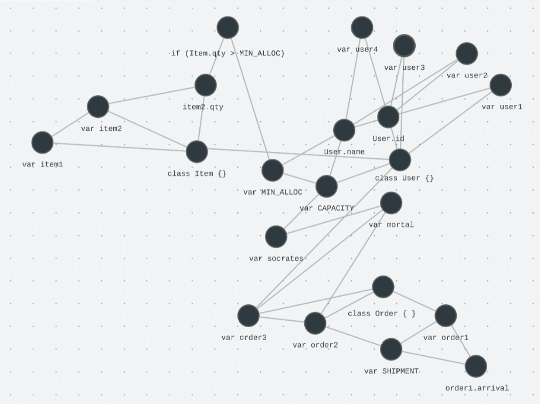

<h1 align="center">Nucleoid</h1>
<p align="center">
  <a href="https://www.apache.org/licenses/LICENSE-2.0"></a>
  <a href="https://www.npmjs.com/package/nucleoidai"></a>
  <a href="https://discord.gg/wN49SNssUw"></a>
</p>


<p align="center">
  <b>Logic Language for LLMs 🌱🐋</b>
  <br/>
  Build World Models 🌍
</p>

<br/>

💭 Hallucinations are a major challenge in LLM reasoning because natural language is unstructured. By nature, LLMs are pattern engines that reason more effectively over structured entities and relationships, enabling more reliable, near-deterministic results.

⚡ Nucleoid is designed with a minimally tokenized syntax for logic representation and a declarative execution model, eliminating the need for LLMs to manually manage control flow, state propagation, and other imperative constructs. In addition, Nucleoid is a next-generation logic programming language built on structured objects and their relationships, extending the traditional Knowledge Graph.

- **Near-Deterministic:** Structured, reliable reasoning.
- **Logic Graph:** Executable knowledge graph.
- **Minimum-Token Syntax:** Token-efficient declarative syntax.

<br />

<div align="center">
  <table>
    <tr>
      <th colspan="2">Nucleoid Runtime</th>
    </tr>
    <tr>
      <th width="300">🦀 Rust-based</th>
      <th width="300">⚡ LLM-based</th>
    </tr>
    <tr>
      <td>
          <b>Programming Language Runtime:</b> Implements the language specification by executing declarative statements.
      </td>
      <td>
        <b>Fine-Tuned LLM:</b> Fine-tuned on synthesized datasets derived from the language specification.
      </td>
    </tr>
    <tr>
      <td align="center"><a href="https://github.com/NucleoidAI/Nucleoid">this repo</a></td>
      <td align="center"><a href="https://huggingface.co/nucleoid">huggingface.co/nucleoid</a></td>
    </tr>
  </table>
</div>

<br />

### Hello World :zap:

**Socrates is mortal without being told so**

```nuc
# There is a Human type with a name
class Human(name: str):
    this.name = name

# Every human is mortal
$Human.mortal = true

# Socrates is a Human
socrates = Human("Socrates")

# Therefore, Socrates is mortal
assert(socrates.mortal, true)
```

---

# Design Theory 📐

<p align="center">
  
</p>

## Language Reference

[**docs/README.md**](docs/README.md) is the language reference: statements and state, variables and dependencies, expressions, types and instances, properties, class-level rules, blocks and scope, control flow, functions, transactions, built-in objects, error messages, and a syntax summary.

It is assembled from the NUC documents in [`docs/`](docs), indexed by [NUC 0](docs/nuc-0000.md) with the conventions in [NUC 1](docs/nuc-0001.md). `nucleoid.spec.md` is normative; where the two disagree, the specification wins.

[**docs/examples.md**](docs/examples.md) covers the same ground as complete programs, each one runnable as written.

A Nucleoid program is a set of statements that remain true. An assignment is not an instruction that runs once and finishes, it is a relationship the runtime records and maintains.

**An assignment states a relationship, not a result**

```nuc
a = 1
b = a + 2

a = 3

assert(b, 5)
```

`b` is never stale. It is the sum of `a` and `2`, so changing `a` brings it up to date, and the same holds for properties, class-level rules and everything else the reference covers.

Every example in the reference is executable: `tests/reference.md` is its executable form and runs under `cargo test`, as do the snippets on this page.

---

<table>
  <tr>
    <td>
      Welcome! I’ve been expecting you—"Skynet was gone. And now one road has become many." 🌐
      <br/>
      <br/>
      The future is building up! World Models are now an emerging field within AI communities and marks a crucial milestone on the journey to AGI. Unfortunately, existing symbolic AI and knowledge graphs lack advancement in today's AI landscape. Nucleoid is revolutionizing knowledge graphs with declarative, logic-based, contextual runtime, which can be integrated with ANNs to lay a robust foundation for the next leap forward imao.
      <br/>
      <br/>
      <p align="right">
        Can Mingir&nbsp;
        <br/>
        <a href="https://github.com/canmingir">@canmingir</a>
      </p>
    </td>
  </tr>
</table>

---

[Nucleoid Chat Video](https://github.com/NucleoidAI/Nucleoid/assets/54210920/813c14fe-43f3-445e-91d8-907433d513de)

## Neuro-Symbolic AI


A world model is what a system knows about a domain: which entities exist, how they relate, which rules hold across all of them, and what follows once something changes. In an LLM that model is implicit, spread across the weights, and that is where hallucination begins, because a model that cannot be inspected cannot be corrected and cannot be held to its own rules. Neuro-Symbolic AI is how the model is made explicit, and it is why the two components below are complementary rather than competing.

Neuro-Symbolic AI is an approach that integrates the strengths of both neural networks and symbolic AI to create systems that can learn from data and also reason logically. By combining these two components, Neuro-Symbolic AI aims to leverage the intuitive, pattern-recognition capabilities of neural networks along with the logical, rule-based reasoning of symbolic AI. This integration offers a more holistic AI system that is both adaptable and able to explain its decisions, making it suitable for complex decision-making tasks where both learning from data and logical reasoning are required. Here’s how it breaks down:

### Neural Networks: The Learning Component

Neural networks in Neuro-Symbolic AI are adept at learning patterns, relationships, and features from large datasets. These networks excel in tasks that involve classification, prediction, and pattern recognition, making them invaluable for processing unstructured data, such as images, text, and audio. Neural networks, through their learning capabilities, can generalize from examples to understand complex data structures and nuances in the data.

### Symbolic AI: The Reasoning Component

The symbolic component of Neuro-Symbolic AI focuses on logic, rules, and symbolic representations of knowledge. Unlike neural networks that learn from data, symbolic AI uses predefined rules and knowledge bases to perform reasoning, make inferences, and understand relationships between entities. This aspect of AI is transparent, interpretable, and capable of explaining its decisions and reasoning processes in a way that humans can understand.

<br/>

<p align="center">
  
</p>

### World Models: The State Component

Neural networks learn and symbolic AI reasons, but reasoning needs something to reason over, and that is the world model: the entities, relationships and rules a system currently holds to be true. In Nucleoid the model is not a passive knowledge base that is read from and written to, it is a logic graph that the runtime keeps true on its own. A rule stated over a type holds for every instance of it, including instances created long afterwards, and a change to any value propagates to everything derived from it, so the model is never left holding a fact together with its own stale consequence.

Rules also decide which worlds are admissible. A statement and every rule it triggers form a single transaction, and if any rule rejects the change, the transaction is rolled back and the state is exactly as it was, so an update that would contradict the model is never partially applied. A world model built this way cannot drift into a state that violates its own laws.

This is what makes the model usable by a language model. It is written incrementally, one statement at a time, in a syntax that costs few tokens, and it can be queried long after it was written, by another session or another model, because the meaning lives in the graph rather than in the context window.

## Declarative Language: 6GL Programming Language

Nucleoid is a 6GL programming language, and Nucleoid acts as the ubiquitous language in Neuro-Symbolic AI for specifying the desired outcomes of a program without detailing the procedural methods to achieve these outcomes. This type of language is essential for articulating logical rules, constraints, and relationships that underpin symbolic reasoning within these systems. It supports the formulation of structured knowledge bases and facilitates logical reasoning tasks, enabling systems to deduce, infer, and respond to queries based on established rules. Moreover, declarative languages are instrumental in integrating the outputs of neural networks into symbolic reasoning frameworks, marrying data-driven learning with rule-based logic. Their widespread use enhances the transparency, explainability, and modularity of AI systems, while also boosting their efficiency in domains heavily reliant on rule-based operations.

### Declarative Logic in Symbolic Reasoning

Declarative logic is a subset of declarative programming, a style of building programs that expresses the logic of a computation without describing its control flow. In declarative logic, you state the facts and rules that define the problem domain. The runtime environment or the system itself figures out how to satisfy those conditions or how to apply those rules to reach a conclusion. This contrasts with imperative programming, where the developer writes code that describes the exact steps to achieve a goal.

Symbolic reasoning refers to the process of using symbols to represent problems and applying logical rules to manipulate these symbols and derive conclusions or solutions. In AI and computer science, it involves using symbolic representations for entities and actions, enabling the system to perform logical inferences, decision making, and problem-solving based on the rules and knowledge encoded in the symbols.

By integrating Nucleoid into Neuro-Symbolic AI, the system benefits from enhanced interpretability and reliability. The declarative logic and rules defined in Nucleoid provide clear explanations for the AI's decisions, making it easier for users to understand and trust the system's outputs. Furthermore, the explicit reasoning capabilities help ensure that decisions are made based on logical principles, adding a layer of reliability and consistency to the AI's behavior.

<p align="center">
  
</p>

### Plasticity in Neuro-Symbolic AI

In the realm of Neuro-Symbolic AI, *Plasticity* is an important element for the system's ability to modify and optimize its connections in response to new information. This concept is inspired by neuroplasticity in biological brains, where neurons can strengthen or weaken their connections based on activity, enabling learning and memory.

1. **Dynamic Knowledge Base**: Neuro-Symbolic AI systems dynamically update their knowledge base as they encounter new scenarios or corrections to their previous knowledge. This continuous updating process allows the systems to remain relevant and accurate over time.
2. **Adaptive Logic and Reasoning**: The AI system can modify its symbolic rules and reasoning strategies to better match observed data or outcomes, enhancing its decision-making and problem-solving abilities.
3. **Generalization and Specialization**: Through plasticity, the system can generalize from learned experiences to new, unseen scenarios or specialize in certain domains by fine-tuning its parameters or rules based on specific data inputs.

The idea of plasticity in AI, especially in logic-based systems like those in Neuro-Symbolic AI, enhances the capability of machines to not only perform tasks based on fixed rules but also to evolve those rules and adapt their reasoning over time, much like the cognitive flexibility of living things.

Learn more at [nucleoid.com/docs/get-started](https://nucleoid.com/docs/get-started)

## Nucleoid's Taxonomy

Nucleoid is an implementation of symbolic AI for declarative (logic) programming at the runtime. As mentioned, the declarative runtime environment manages the state and stores each transaction in the built-in data store by declaratively rerendering statements and building the knowledge graph (base) as well as an execution plan.

<p align="center">
  
</p>

The declarative runtime isolates a behavior definition of a program from its technical instructions and executes declarative statements, which represent logical intention without carrying any technical detail. In this paradigm, there is no segregation regarding what data is or not, instead approaches how data (declarative statement) is related with others so that any type of data including business rules can be added without requiring any additional actions such as compiling, configuring, restarting as a result of plasticity. This approach also opens possibilities of storing data in the same box with the programming runtime.

<div align="center">
  <table>
    <tr>
      <th>
        
      </th>
      <th>
        
      </th>
    </tr>
  </table>
</div>

In short, the main objective of the project is to manage both of data and logic under the same runtime. The declarative programming paradigm used by Nucleoid allows developers to focus on the business logic of the application, while the runtime manages the technical details.This allows for faster development and reduces the amount of code that needs to be written. Additionally, the sharding feature can help to distribute the load across multiple instances, which can further improve the performance of the system.

## Benchmark

This is the comparation our sample order app in Nucleoid IDE against MySQL and Postgres with using Express.js and Sequelize libraries.


> Performance benchmark happened in t2.micro of AWS EC2 instance and both databases had dedicated servers with <u>no indexes and default configurations</u>.

https://github.com/NucleoidAI/benchmark

As seen in the chart, for applications with average complexity, Nucleoid's performance is close to linear because of on-chain data store, in-memory computing model as well as limiting the IO process.

<br/>

---

<p align="center">
  <b>⭐️ Star us on GitHub for the support</b>
</p>

World Models are an emerging field and thanks to declarative logic programming, we have a brand-new approach to building World Models. Join us in shaping the future of AI!

<p align="center">
  
</p>

---

## Contributors

<!-- NucBot -->

<table><tr><td align="center"><a href="https://github.com/NucBot"><br/><sub>NucBot</sub></a></td><td align="center"><a href="https://github.com/canmingir"><br/><sub>canmingir</sub></a></td><td align="center"><a href="https://github.com/322332"><br/><sub>322332</sub></a></td><td align="center"><a href="https://github.com/dependabot[bot]"><br/><sub>dependabot[bot]</sub></a></td><td align="center"><a href="https://github.com/francisco-giancarelli-crombie"><br/><sub>francisco-giancarelli-crombie</sub></a></td><td align="center"><a href="https://github.com/Gulshanaggarwal"><br/><sub>Gulshanaggarwal</sub></a></td><td align="center"><a href="https://github.com/CanPacis"><br/><sub>CanPacis</sub></a></td></tr><tr><td align="center"><a href="https://github.com/durulkoca"><br/><sub>durulkoca</sub></a></td><td align="center"><a href="https://github.com/halilcengel"><br/><sub>halilcengel</sub></a></td><td align="center"><a href="https://github.com/EnesKeremAYDIN"><br/><sub>EnesKeremAYDIN</sub></a></td><td align="center"><a href="https://github.com/russle-smith"><br/><sub>russle-smith</sub></a></td><td align="center"><a href="https://github.com/russellgray"><br/><sub>russellgray</sub></a></td></tr></table>

<br/>

Generated by <a href="https://github.com/NucleoidAI/NucBot">NucBot</a>
