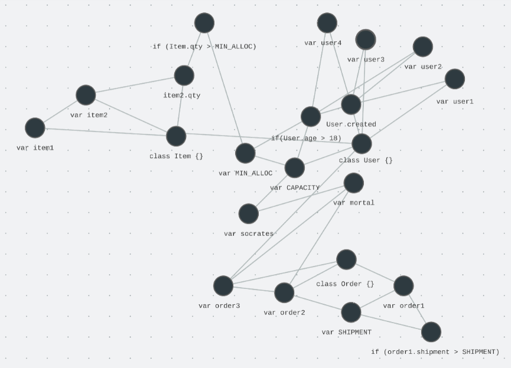

<h1 align="center">Nucleoid</h1>
<p align="center">
  Neuro-Symbolic AI with Knowledge Graph
</p>

<p align="center">
  <a href="https://www.apache.org/licenses/LICENSE-2.0"></a>
  <a href="https://www.npmjs.com/package/nucleoidai"></a>
  <a href="https://discord.gg/wN49SNssUw"></a>
</p>


<p align="center">
  Declarative (Logic) Runtime Environment: Extensible Data and Logic Representation
</p>

<br/>

Nucleoid is a declarative, logic-based, contextual runtime for Neuro-Symbolic AI. Nucleoid runtime tracks each statement in [IPL-inspired](https://en.wikipedia.org/wiki/Information_Processing_Language) declarative JavaScript syntax and dynamically creates relationships between both logic and data statements in the knowledge graph to used in decision-making and problem-solving process.

- **Adaptive Reasoning:** Combines symbolic logic with contextual information to analyze relationships, draw conclusions and incorporating new information and adjusting its conclusions accordingly.
- **Logic Graph:** Specialized knowledge graph that captures relationships between both logic and data statements based on formal logic, facilitating complex deductions and adapting to new information.
- **Explainability:** The Logic Graph provides a transparent representation of the reasoning process, making it easier to understand how decisions are reached and potential biases are identified.

Echoing to the idea of ["thinking, fast and slow"](https://kahneman.scholar.princeton.edu/publications), AI system should provide fast, “intuitive” ideas, and the other, more deliberate, rational decision-making. D(L)RE enables both intuitive decisions based on contextual information and deliberate, well-reasoned decisions based on logical deductions.

[Nucleoid Chat Video](https://github.com/NucleoidAI/Nucleoid/assets/54210920/813c14fe-43f3-445e-91d8-907433d513de)

<p align="center">
  Chat for Logical Context
  <br/>
  <a href="https://nucleoid.ai/chat">https://nucleoid.ai/chat</a>
</p>

In Nucleoid's paradigm, there is no segregation between logic and data; instead, the paradigm approaches how both logic and data statements are related to each other. As the runtime receives new statements, it updates the knowledge graph and reevaluates both logic and data statements to reflect the new information. This adaptive process enables the system to respond to new situations and make deterministic selections as a result of plasticity.

<div align="center">
  <table>
    <tr>
      <th colspan="3">
        Multi Lang Support
      </th>
    </tr>
    <tr>
      <td>
        <p align="center">
          
          <br/>
          JavaScript
        </p>
      </td>
      <td>
        <p align="center">
          
          <br/>
          TypeScript (Beta)
        </p>
      </td>
      <td>
        <p align="center">
          
          <br/>
          Python (WiP)
        </p>
      </td>
    </tr>
    <tr>
      <td colspan="3">
        The declarative structure in the runtime makes it possible to provide multiple language support through JIT compiler.
      </td>
    </tr>
  </table>
</div>

---

<table>
  <tr>
    <td>
      Welcome! I’ve been expecting you—"Skynet was gone. And now one road has become many." 🌐
      <br/>
      <br/>
      The future is building up! Neuro-Symbolic AI is now an emerging field within AI communities and marks a crucial milestone on the journey to AGI. Unfortunately, existing symbolic AI and knowledge graphs lack advancement in today's AI landscape. Nucleoid is revolutionizing knowledge graphs with declarative, logic-based, contextual runtime, which can be integrated with ANNs to lay a robust foundation for the next leap forward. We use JavaScript inside the runtime, simply because JavaScript is the language of the internet so that every piece of code is inherently dynamic, making it an ideal candidate. Sadly, Python's interpreter structure makes its dynamic eval function extremely slow, but in good side, the future looks bright as it will harness the strengths of both languages, much like the fusion of neuro and symbolic AI leverages their respective strengths!
      <br/>
      <br/>
      <p align="right">
        Can Mingir&nbsp;
        <br/>
        <a href="https://github.com/canmingir">@canmingir</a>
      </p>
    </td>
  </tr>
</table>

## What is Neuro-Symbolic AI?


Neuro-Symbolic AI is an approach that integrates the strengths of both neural networks and symbolic AI to create systems that can learn from data and also reason logically. By combining these two components, Neuro-Symbolic AI aims to leverage the intuitive, pattern-recognition capabilities of neural networks along with the logical, rule-based reasoning of symbolic AI. This integration offers a more holistic AI system that is both adaptable and able to explain its decisions, making it suitable for complex decision-making tasks where both learning from data and logical reasoning are required. Here’s how it breaks down:

### Neural Networks: The Learning Component

Neural networks in Neuro-Symbolic AI are adept at learning patterns, relationships, and features from large datasets. These networks excel in tasks that involve classification, prediction, and pattern recognition, making them invaluable for processing unstructured data, such as images, text, and audio. Neural networks, through their learning capabilities, can generalize from examples to understand complex data structures and nuances in the data.

### Symbolic AI: The Reasoning Component

The symbolic component of Neuro-Symbolic AI focuses on logic, rules, and symbolic representations of knowledge. Unlike neural networks that learn from data, symbolic AI uses predefined rules and knowledge bases to perform reasoning, make inferences, and understand relationships between entities. This aspect of AI is transparent, interpretable, and capable of explaining its decisions and reasoning processes in a way that humans can understand.

<br/>

<p align="center">
  
</p>

#### Declarative Logic in Symbolic Reasoning

Declarative logic is a subset of declarative programming, a style of building programs that expresses the logic of a computation without describing its control flow. In declarative logic, you state the facts and rules that define the problem domain. The runtime environment or the system itself figures out how to satisfy those conditions or how to apply those rules to reach a conclusion. This contrasts with imperative programming, where the developer writes code that describes the exact steps to achieve a goal.

Symbolic reasoning refers to the process of using symbols to represent problems and applying logical rules to manipulate these symbols and derive conclusions or solutions. In AI and computer science, it involves using symbolic representations for entities and actions, enabling the system to perform logical inferences, decision making, and problem-solving based on the rules and knowledge encoded in the symbols.

By integrating Nucleoid into Neuro-Symbolic AI, the system benefits from enhanced interpretability and reliability. The declarative logic and rules defined in Nucleoid provide clear explanations for the AI's decisions, making it easier for users to understand and trust the system's outputs. Furthermore, the explicit reasoning capabilities help ensure that decisions are made based on logical principles, adding a layer of reliability and consistency to the AI's behavior.

<p align="center">
  
</p>

### Plasticity in Neuro-Symbolic AI

In the realm of Neuro-Symbolic AI, *Plasticity* is an important element for the system's ability to modify and optimize its connections in response to new information. This concept is inspired by neuroplasticity in biological brains, where neurons can strengthen or weaken their connections based on activity, enabling learning and memory.

1. **Dynamic Knowledge Base**: Neuro-Symbolic AI systems dynamically update their knowledge base as they encounter new scenarios or corrections to their previous knowledge. This continuous updating process allows the systems to remain relevant and accurate over time.
2. **Adaptive Logic and Reasoning**: The AI system can modify its symbolic rules and reasoning strategies to better match observed data or outcomes, enhancing its decision-making and problem-solving abilities.
3. **Generalization and Specialization**: Through plasticity, the system can generalize from learned experiences to new, unseen scenarios or specialize in certain domains by fine-tuning its parameters or rules based on specific data inputs.

The idea of plasticity in AI, especially in logic-based systems like those in Neuro-Symbolic AI, enhances the capability of machines to not only perform tasks based on fixed rules but also to evolve those rules and adapt their reasoning over time, much like the cognitive flexibility of living things.

## Hello World :zap:

```javascript
User:
> 'Define human with name'

Assistant:
> 'The user requested to define a human with a name using a declarative class'

---

// Ubiquitous Code:
'use declarative';

class Human {
  name: string;
  constructor(name: string) {
    this.name = name;
  }
}
```

```javascript
User:
> 'All humans are mortal'

Assistant: All humans are mortal
> 'All humans were declared as mortal.'

---

// Ubiquitous Code:
'use declarative';

$Human.mortal = true;
```

```javascript
User:
> 'Create a human with name "Socrates"'

Assistant:
> 'A human named 'Socrates' was successfully created.'

---

// Ubiquitous Code:
'use imperative';

var human1 = new Human('Socrates');

// Result: {"id":"human1","name":"Socrates","mortal":true}
```

```javascript
User:
> 'Is human with name 'Socrates' mortal?'

Assistant:
> 'The human named 'Socrates' was determined to be mortal.'

---

// Ubiquitous Code:
`use imperative`;

var human1 = new Human('Socrates');
human1.mortal;
// Result: true
```

Learn more at [nucleoid.com/docs/get-started](https://nucleoid.com/docs/get-started)

> :bulb: Nucleoid runtime can also run on local machine with `npx @nucleoidai/ide start` and `npx @nucleoidai/expert start` including [Nucleoid Chat](https://nucleoid.com/ide/chat). These commands enable IDE and expert system components needed for Neuro-Symbolic AI.

---

### Under the hood: Declarative (Logic) Runtime Environment

Nucleoid is an implementation of symbolic AI for declarative (logic) programming at the runtime. As mentioned, the declarative runtime environment manages JavaScript state and stores each transaction in the built-in data store by declaratively rerendering JavaScript statements and building the knowledge graph (base) as well as an execution plan.

<p align="center">
  
</p>

The declarative runtime isolates a behavior definition of a program from its technical instructions and executes declarative statements, which represent logical intention without carrying any technical detail. In this paradigm, there is no segregation regarding what data is or not, instead approaches how data (declarative statement) is related with others so that any type of data including business rules can be added without requiring any additional actions such as compiling, configuring, restarting as a result of plasticity. This approach also opens possibilities of storing data in the same box with the programming runtime.

<div align="center">
  <table>
    <tr>
      <th>
        
      </th>
      <th>
        
      </th>
    </tr>
  </table>
</div>

In short, the main objective of the project is to manage both of data and logic under the same runtime. The declarative programming paradigm used by Nucleoid allows developers to focus on the business logic of the application, while the runtime manages the technical details.This allows for faster development and reduces the amount of code that needs to be written. Additionally, the sharding feature can help to distribute the load across multiple instances, which can further improve the performance of the system.

## Benchmark

This is the comparation our sample order app in Nucleoid IDE against MySQL and Postgres with using Express.js and Sequelize libraries.

https://nucleoid.com/ide/sample


> Performance benchmark happened in t2.micro of AWS EC2 instance and both databases had dedicated servers with <u>no indexes and default configurations</u>.

https://github.com/NucleoidAI/benchmark

This does not necessary mean Nucleoid runtime is faster than MySQL or Postgres, instead databases require constant maintenance by DBA teams with indexing, caching, purging etc. however, Nucleoid tries to solve this problem with managing logic and data internally. As seen in the chart, for applications with average complexity, Nucleoid's performance is close to linear because of on-chain data store, in-memory computing model as well as limiting the IO process.

<br/>

## Project Status :avocado:

Track at [Trello](https://trello.com/b/TZ73H1Fk/nucleoid)

- [x] [Beta](https://www.npmjs.com/package/nucleoidai) is out
- [x] ES6 support
- [ ] ES2018 support
- [ ] ES2020 support
- [ ] TypeScript
- [ ] [IDE](https://github.com/NucleoidAI/IDE) (WiP)
- [ ] Production-ready

Please report an [issue](https://github.com/NucleoidAI/Nucleoid/issues) or ask a question at [Discussions](https://github.com/NucleoidAI/Nucleoid/discussions)

Learn more at [nucleoid.com](https://nucleoid.ai)

<br/>

---

<p align="center">
  <b>⭐️ Star us on GitHub for the support</b>
</p>

Neuro-Symbolic AI is an emerging field and thanks to declarative logic programming, we have a brand-new approach to Neuro-Symbolic AI. Join us in shaping the future of AI!

<p align="center">
  
</p>

---

## Contributors

<!-- NucBot -->

<table><tr><td align="center"><a href="https://github.com/NucBot"><br/><sub>NucBot</sub></a></td><td align="center"><a href="https://github.com/canmingir"><br/><sub>canmingir</sub></a></td><td align="center"><a href="https://github.com/322332"><br/><sub>322332</sub></a></td><td align="center"><a href="https://github.com/dependabot[bot]"><br/><sub>dependabot[bot]</sub></a></td><td align="center"><a href="https://github.com/francisco-giancarelli-crombie"><br/><sub>francisco-giancarelli-crombie</sub></a></td><td align="center"><a href="https://github.com/Gulshanaggarwal"><br/><sub>Gulshanaggarwal</sub></a></td><td align="center"><a href="https://github.com/CanPacis"><br/><sub>CanPacis</sub></a></td></tr><tr><td align="center"><a href="https://github.com/durulkoca"><br/><sub>durulkoca</sub></a></td><td align="center"><a href="https://github.com/halilcengel"><br/><sub>halilcengel</sub></a></td><td align="center"><a href="https://github.com/EnesKeremAYDIN"><br/><sub>EnesKeremAYDIN</sub></a></td><td align="center"><a href="https://github.com/russle-smith"><br/><sub>russle-smith</sub></a></td><td align="center"><a href="https://github.com/russellgray"><br/><sub>russellgray</sub></a></td></tr></table>

<br/>

Generated by <a href="https://github.com/NucleoidAI/NucBot">NucBot</a>
